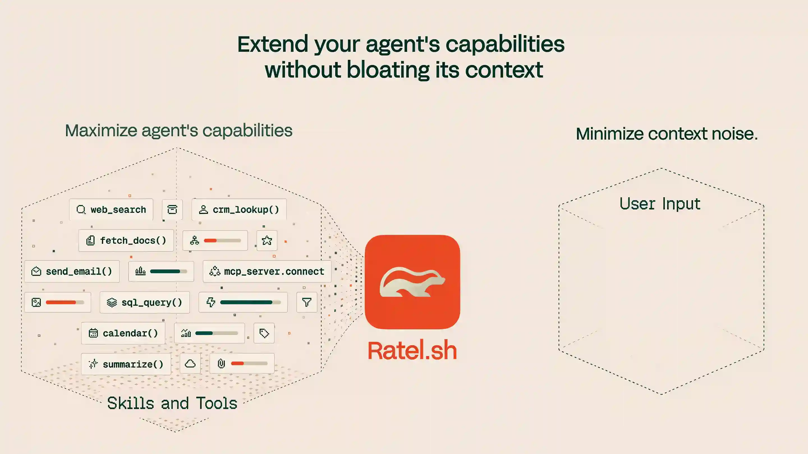

<div align="center">
  <h1>Ratel</h1>
  <h4>Context engineering for AI agents — engineer the context your agent actually needs, on every turn.</h4>

  <p>
    <a href="https://docs.ratel.sh">Docs</a> •
    <a href="https://github.com/ratel-ai/skills">Skills</a> •
    <a href="./docs/roadmap.md">Roadmap</a> •
    <a href="https://discord.gg/75vAPdjYqT">Discord</a>
  </p>

  <p>
    <a href="https://www.npmjs.com/package/@ratel-ai/sdk"></a>
    <a href="https://crates.io/crates/ratel-ai-core"></a>
    <a href="https://github.com/ratel-ai/ratel/stargazers"></a>
    <a href="./LICENSE.md"></a>
  </p>
</div>

<div align="center">
  
</div>

> Most agents stuff every tool, skill, and memory into the context window each turn — burning tokens, drifting on the long tail. Ratel sits between the agent and its catalog, and resolves only what matters for *this* turn.

## Integrate Ratel in 60 seconds

The fastest way to get Ratel into your agent is the **Ratel skills suite** — five Claude Code / Cursor / Codex skills that integrate Ratel, plan observability, design dashboards, audit your codebase, and analyse live traces.

Install all five:

```bash
npx skills add ratel-ai/skills --all
```

Or paste this into your coding agent — it installs the suite and walks you through a concrete Ratel integration plan:

```text
Run npx skills add ratel-ai/skills --all and use the skills to integrate Ratel in this project.
```

Want a read on the rest of your agent first? The same suite ships a free, static `ratel-assessment` — no engagement required. Paste this instead:

```text
Run npx skills add ratel-ai/skills --all and use the skills to assess the agents in this codebase and show me where Ratel would help.
```

Full skills suite: [`ratel-ai/skills`](https://github.com/ratel-ai/skills)

## What is Ratel

**This repo is the library.** An in-process **context engineering platform** for AI agents — a catalog, a retrieval engine, and the runtime hooks that decide what ends up in the model's context window on every turn.

- **Wedge today**: tool selection. Register tools (or ingest an upstream MCP server) into a `ToolCatalog`; the model sees the handful that matter for the current turn, not the full list.
- **Same primitives** now rank skills too — reusable playbooks alongside tools; memories and message history extend them as they land on the roadmap.
- **Stack**: Rust core (`ratel-ai-core`) + TypeScript SDK (`@ratel-ai/sdk`, NAPI-bound) + Python SDK (`ratel-ai`, PyO3-bound) + auxiliary CLI (`@ratel-ai/cli`) for the artifacts the library produces (telemetry today; trace-consolidation server later).
- **No vector DB. No embedding pipeline. No service to deploy.**

See [`docs/overview.md`](docs/overview.md) for the thesis, [`docs/roadmap.md`](docs/roadmap.md) for what's coming.

## The Ratel project

Three repos, one story:

| | Repo | What it is |
|---|---|---|
| **Library** | [`ratel-ai/ratel`](https://github.com/ratel-ai/ratel) (this one) | The engine. Rust core + TS SDK + auxiliary CLI. Embed it in your agent process. |
| **Showcase** | [`ratel-ai/ratel-mcp`](https://github.com/ratel-ai/ratel-mcp) | The first canonical product on the library — `@ratel-ai/mcp-server` exposes any catalog over MCP, with a `ratel-mcp` CLI that fronts Claude Code / Cursor / ChatGPT and an OAuth-aware gateway for upstream MCP servers. Proof that the library is enough to build a real product on. |
| **Proof** | [`ratel-ai/ratel-bench`](https://github.com/ratel-ai/ratel-bench) | The benchmark harness — MetaTool agent campaign, ToolRet retrieval, three Ratel ablation arms across local / OSS / frontier models. The numbers in the table below come from here. |


## Why Ratel

- **Retrieval, not stuffing.** BM25 over a schema-aware text projection of every tool — deterministic, no embeddings, no inference cost on the retrieval path ([ADR‑0004](docs/adr/0004-bm25-tool-indexing.md)).
- **~2 tools per turn.** Replace-by-default tool injection ([ADR‑0003](docs/adr/0003-tool-selection-replace-vs-suggest.md)): the agent's tool list at any turn is the top‑K hits. Less context, less drift, lower cost.
- **In-process, no infra.** Pre-built native bindings for darwin / linux / win — no Rust toolchain to install.
- **Framework-agnostic.** `ToolCatalog` returns generic `ExecutableTool` objects you wrap in a few lines (Vercel AI SDK example shipped in `examples/ai-sdk`, `examples/mcp-chat`). Or skip the framework and expose the catalog over MCP.

## Proof: where Ratel is most valuable today

| your situation | Ratel's value today |
|---|---|
| Local model + large catalog | **Critical.** qwen3.5 at pool=100 goes from 8% → 77% — the baseline collapses, Ratel keeps it working. |
| Open-source cloud + large catalog | **Strong win.** glm-5.1 at pool=180: **+12 pp** accuracy, **-85%** input tokens. |
| Frontier (Sonnet) + large catalog | **Cost-driven win.** Sonnet 4.6 at pool=180: **-82%** input tokens, **-68%** $; -8 pp accuracy (closing). |
| Frontier (Opus) + large catalog | **Competitive win.** Opus 4.6 pool=180: **+8 pp** accuracy and **-72%** tokens (discovery-tool arm). Opus 4.7 pool=180: ≈parity (-1.7 pp) with **-81%** tokens — Anthropic's own tool-search-tool loses **-8 pp** on the same setup. |
| Any model + tiny catalog (≤30) | Skip Ratel — pool fits in the prompt cleanly. |

Numbers from the MetaTool agent benchmark — full per-pool breakdown and methodology in [ratel-ai/ratel-bench › `RESULTS.md`](https://github.com/ratel-ai/ratel-bench/blob/main/RESULTS.md). The benchmark harness lives in its own public repo: [ratel-ai/ratel-bench](https://github.com/ratel-ai/ratel-bench).

## Choose your path

If you want to **embed the library** in your own agent or runtime, pick one of these shapes — same Rust core under each:

|               | **Rust library**                          | **TypeScript SDK**                    | **Python SDK**                        | **CLI**                                                       |
| ------------- | ----------------------------------------- | ------------------------------------- | ------------------------------------- | ------------------------------------------------------------- |
| **For**       | Rust agents and downstream SDKs           | TS / Node agents                      | Python agents                         | Inspecting telemetry the library writes; migrating a Claude Code MCP setup into Ratel (transitional) |
| **Install**   | `cargo add ratel-ai-core`                 | `pnpm add @ratel-ai/sdk`              | `pip install ratel-ai`                | `pnpm add -g @ratel-ai/cli`                                   |
| **Hero call** | `ToolRegistry::search`                    | `searchCapabilitiesTool(catalog)`     | `search_capabilities_tool(catalog)`   | `ratel inspect`                                               |
| **Reference** | [src/core/lib/](src/core/lib/README.md)   | [src/sdk/ts/](src/sdk/ts/README.md)   | [src/sdk/python/](src/sdk/python/README.md) | [src/integrations/cli/](src/integrations/cli/README.md) |

If instead you want to **drop Ratel between an MCP host and your existing upstream MCP servers** (Claude Code, Cursor, ChatGPT) — the showcase product — use [`@ratel-ai/mcp-server` from `ratel-ai/ratel-mcp`](https://github.com/ratel-ai/ratel-mcp): `npx -y @ratel-ai/mcp-server mcp import`.

The Rust HTTP server is on the [roadmap](docs/roadmap.md), not yet shipped.

## Quickstart

**TypeScript SDK** — embed Ratel in a TS / Node agent

```bash
pnpm add @ratel-ai/sdk
```

```ts
import { ToolCatalog, searchCapabilitiesTool, invokeToolTool } from "@ratel-ai/sdk";

const catalog = new ToolCatalog();
catalog.register({
  id: "read_file",
  name: "read_file",
  description: "Read a file from local disk.",
  inputSchema: { properties: { path: { type: "string" } } },
  outputSchema: { properties: { contents: { type: "string" } } },
  execute: async ({ path }) => ({ contents: await fs.readFile(path, "utf8") }),
});

// Hand these two tools to your agent loop.
// The full catalog stays out of the model's context — the agent reaches it via search_capabilities / invoke_tool.
const search = searchCapabilitiesTool(catalog);
const invoke = invokeToolTool(catalog);
```

- End-to-end Vercel AI SDK: [examples/ai-sdk/](examples/ai-sdk/README.md)
- Ingest an upstream MCP server: [registerMcpServer](src/sdk/ts/README.md#registermcpserver--index-an-mcp-servers-tools-into-the-catalog)
- Full SDK reference: [src/sdk/ts/README.md](src/sdk/ts/README.md)

**Python SDK** — embed Ratel in a Python agent

```bash
pip install ratel-ai
```

```python
from ratel_ai import ToolCatalog, ExecutableTool, search_capabilities_tool, invoke_tool_tool

catalog = ToolCatalog()
catalog.register(
    ExecutableTool(
        id="read_file",
        name="read_file",
        description="Read a file from local disk.",
        input_schema={"properties": {"path": {"type": "string"}}},
        output_schema={"properties": {"contents": {"type": "string"}}},
        execute=lambda args: {"contents": open(args["path"]).read()},
    )
)

# Hand these two tools to your agent loop.
# The full catalog stays out of the model's context — the agent reaches it via search_capabilities / invoke_tool.
search = search_capabilities_tool(catalog)
invoke = invoke_tool_tool(catalog)
```

- End-to-end Pydantic AI: [examples/pydantic-ai/](examples/pydantic-ai/README.md)
- Full SDK reference: [src/sdk/python/README.md](src/sdk/python/README.md)

**Showcase: drop Ratel between Claude Code and your existing MCP servers**

For the canonical "Ratel as a product" experience — managing scopes, importing from Claude Code, OAuth for HTTP upstreams, serving over stdio — use the MCP-server showcase repo:

```bash
npx -y @ratel-ai/mcp-server mcp import   # interactive migration wizard
```

Full CLI reference, install options, and library docs: [`ratel-ai/ratel-mcp`](https://github.com/ratel-ai/ratel-mcp). `@ratel-ai/cli` in this repo retains the same MCP verbs transitionally (it depends on the same published `@ratel-ai/mcp-server` library); over time those verbs migrate to `ratel-mcp` and the local `ratel` binary focuses on library artifacts (`ratel inspect`, etc.).

**Rust library** — direct, no JS in the loop

```bash
cargo add ratel-ai-core
```

In-process BM25 retrieval over a schema-aware text projection of each tool. See [src/core/lib/README.md](src/core/lib/README.md) and [docs.rs/ratel-ai-core](https://docs.rs/ratel-ai-core).

## How it works (today)

- **Tool selection** is the v0.1.x shipping path. Ratel sits between agent and catalog.
- Each turn, the agent either calls `search_capabilities(query)` or — in pre-filter mode — receives the top‑K hits resolved at message start. The full list never enters context.
- The catalog holds local executables, upstream MCP servers' tools (via `registerMcpServer`), or both — the model sees a unified, ranked surface.
- Under the hood: `ratel-ai-core`, a Rust BM25 index over a deterministic, schema-aware text projection of each tool. No embeddings, no vector DB, no inference latency on the retrieval path.

Longer take + skills / telemetry / memories / context graph: [docs/overview.md](docs/overview.md).

## Examples

- [examples/ai-sdk/](examples/ai-sdk/README.md) — Vercel AI SDK with pre-filter + dynamic gateway
- [examples/mcp-chat/](examples/mcp-chat/README.md) — Vercel AI SDK REPL ingesting an upstream MCP server via `registerMcpServer`
- [examples/pydantic-ai/](examples/pydantic-ai/README.md) — Pydantic AI (Python) with pre-filter + dynamic gateway

## Where this is going

Tool selection is the wedge, not the destination. Same catalog, same retrieval engine, same in-process runtime — widening into the rest of the agent's context surface:

- **v0.1.x** — telemetry + UI inspector, JSON→TOON encoding, MCP `tools/list_changed`, first-class **skills**, LLM-driven catalog suggestions, multi-agent decomposition hints, semantic re-ranking over BM25, opt-in self-hosted trace server.
- **v0.2.x — chat management** — store / compact / prune / navigate long histories.
- **v0.3.x — memories** — prior decisions, preferences, and artifacts ranked into the current turn.
- **v0.4.x — context graph** — unified tools-skills-memories substrate.

The **Python SDK** (`pip install ratel-ai`) shipped early — a second host language on the same Rust core, at full parity with the TS SDK.

Dated milestones: [`docs/roadmap.md`](docs/roadmap.md). Thesis: [`docs/overview.md`](docs/overview.md).

## Repo layout

This repo holds the **library** half of the project. The MCP-server showcase and the benchmark harness live in sibling repos.

```
src/
├── core/lib/                  # ratel-ai-core — Rust crate; BM25 retrieval engine
├── sdk/ts/                    # @ratel-ai/sdk — TypeScript SDK (NAPI-bound)
├── sdk/python/                # ratel-ai — Python SDK (PyO3-bound)
└── integrations/
    └── cli/                   # @ratel-ai/cli — `ratel` CLI (telemetry inspect; transitional MCP verbs)
examples/                      # Runnable end-to-end examples for the SDK
docs/                          # Overview, roadmap, ADRs
```

Sibling repos:

- [`ratel-ai/ratel-mcp`](https://github.com/ratel-ai/ratel-mcp) — **showcase**. `@ratel-ai/mcp-server` library + `ratel-mcp` CLI.
- [`ratel-ai/ratel-bench`](https://github.com/ratel-ai/ratel-bench) — **proof**. Benchmark harness; numbers in [`RESULTS.md`](https://github.com/ratel-ai/ratel-bench/blob/main/RESULTS.md).

## Build & test

Prerequisites: Rust stable (pinned via `rust-toolchain.toml`), Node 24+, pnpm 10.28+. For the Python SDK: Python 3.9+ and [`uv`](https://docs.astral.sh/uv/).

```bash
# Rust
cargo build --workspace
cargo clippy --workspace --all-targets -- -D warnings
cargo fmt --check --all
cargo test --workspace

# TS
pnpm install
pnpm -r build
pnpm -r typecheck
pnpm -r lint
pnpm -r test

# Python (from src/sdk/python/)
uv venv --python 3.11 .venv
uv pip install --python .venv maturin pytest pytest-asyncio ruff mypy
.venv/bin/maturin develop
.venv/bin/ruff check . && .venv/bin/mypy ratel_ai && .venv/bin/pytest
```

CI runs all three pipelines on every PR (`.github/workflows/{rust,ts,python}.yml`).

## Architecture decisions

Full record in [docs/adr/](docs/adr/). Cross-cutting locks worth knowing up front:

- [ADR 0002 — TS↔Rust binding via NAPI-RS](docs/adr/0002-ts-rust-binding-strategy.md)
- [ADR 0003 — Tool selection: replace by default, suggest opt-in](docs/adr/0003-tool-selection-replace-vs-suggest.md)
- [ADR 0004 — BM25 tool indexing strategy](docs/adr/0004-bm25-tool-indexing.md)
- [ADR 0006 — Benchmark corpus and eval modes](docs/adr/0006-benchmark-corpus-and-eval-modes.md)
- [ADR 0011 — Python↔Rust binding via PyO3](docs/adr/0011-python-rust-binding-strategy.md)

## Contributing

- Humans: [CONTRIBUTING.md](CONTRIBUTING.md)
- Coding agents in this repo: [AGENTS.md](AGENTS.md)
- LLM index of the docs: [llms.txt](llms.txt)

## License

**MIT**. Free to use, modify, and redistribute. See [LICENSE.md](LICENSE.md).
