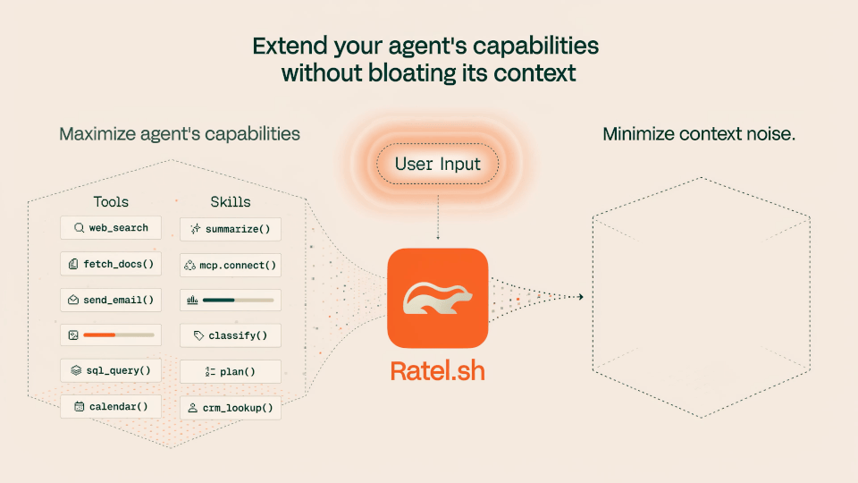

<div align="center">
  <h1>Ratel</h1>
  <p>Your AI agent is paying for tools it never uses. Ratel fixes that.</p>

  <p>
    <a href="https://docs.ratel.sh">Docs</a> •
    <a href="https://github.com/ratel-ai/skills">Skills</a> •
    <a href="https://discord.gg/75vAPdjYqT">Discord</a>
  </p>

  <p>
    <a href="https://www.npmjs.com/package/@ratel-ai/sdk"></a>
    <a href="https://pypi.org/project/ratel-ai/"></a>
    <a href="https://crates.io/crates/ratel-ai-core"></a>
    <a href="https://github.com/ratel-ai/ratel/stargazers"></a>
    <a href="https://discord.gg/75vAPdjYqT"></a>
    <a href="#license"></a>
  </p>
</div>

<div align="center">
  
</div>

## Introduction

The context engineering layer for AI agents. Selects only the tools and skills relevant to each turn, recovering accuracy lost to tool overload and cutting what you pay per call. No vector DB, no infra.

## Why

- **Cost:** Every tool schema, every skill, and a growing list of instructions in the system prompt are tokens you pay for on every call. Send them all up front and you pay for them all, every turn.
- **Accuracy:** Models get worse as that context grows. Crowd it with tools, skills, and instructions a turn doesn't need and the model picks the wrong option and drifts off task.
- **Ratel fixes both:** it indexes your tools and skills into a catalog the agent *progressively discloses*, searching for what each turn needs and injecting only the matching capabilities instead of loading everything up front.

Across local, open-source, and frontier model setups, Ratel cuts token usage and recovers accuracy lost to tool overload, with no vector DB required. Full results: [benchmark.ratel.sh](https://benchmark.ratel.sh)

## Quickstart

Guides: [Quickstart](https://docs.ratel.sh/docs/quickstart) · [TypeScript SDK](https://docs.ratel.sh/docs/sdks/typescript) · [Python SDK](https://docs.ratel.sh/docs/sdks/python)

Examples: [Vercel AI SDK](examples/ai-sdk/README.md) · [Pydantic AI](examples/pydantic-ai/README.md)

### Typescript

Install the SDK first:

```bash
pnpm add @ratel-ai/sdk
```

Then create and use your Catalogs:

```ts
import { readFile } from "node:fs/promises";
import {
  SkillCatalog,
  ToolCatalog,
  getSkillContentTool,
  invokeToolTool,
  searchCapabilitiesTool,
} from "@ratel-ai/sdk";

const catalog = new ToolCatalog();
catalog.register({
  id: "read_file",
  name: "read_file",
  description: "Read a file from local disk.",
  inputSchema: { type: "object", properties: { path: { type: "string" } } },
  outputSchema: { type: "object", properties: { contents: { type: "string" } } },
  execute: async ({ path }) => ({ contents: await readFile(path, "utf8") }),
});

const skills = new SkillCatalog();
skills.register({
  id: "inspect-local-file",
  name: "inspect-local-file",
  description: "Inspect a local file before answering questions about it.",
  tools: ["read_file"],
  body: "Read the requested file, then ground your answer in its contents.",
});

// use the following as tools in your agent framework
const search = searchCapabilitiesTool(catalog, skills);
const invoke = invokeToolTool(catalog);
const loadSkill = getSkillContentTool(skills);
```


### Python

Install the SDK first:

```bash
pip install ratel-ai
```

Then create and use your Catalogs:

```python
from ratel_ai import (
    ExecutableTool,
    Skill,
    SkillCatalog,
    ToolCatalog,
    get_skill_content_tool,
    invoke_tool_tool,
    search_capabilities_tool,
)

catalog = ToolCatalog()
catalog.register(ExecutableTool(
    id="read_file",
    name="read_file",
    description="Read a file from local disk.",
    input_schema={"properties": {"path": {"type": "string"}}},
    execute=lambda args: {"contents": open(args["path"]).read()},
))

skills = SkillCatalog()
skills.register(Skill(
    id="inspect-local-file",
    name="inspect-local-file",
    description="Inspect a local file before answering questions about it.",
    tools=["read_file"],
    body="Read the requested file, then ground your answer in its contents.",
))

# use the following as tools in your agent framework
search = search_capabilities_tool(catalog, skills)
invoke = invoke_tool_tool(catalog)
load_skill = get_skill_content_tool(skills)
```

## How it works

When your agent needs to act, it calls `search_capabilities`. Ratel searches separate tool and skill indexes and returns focused results from each. Tools can be invoked by id; skill instructions stay out of context until the agent loads a relevant playbook with `get_skill_content`.

The indexes use BM25 by default, the same algorithm behind most search engines, applied to schema-aware tool metadata and skill names, descriptions, and tags. Retrieval is fast and deterministic. Semantic and hybrid ranking are opt-in per catalog or per call; SDK callers register (which embeds) and search dense indexes asynchronously, using either an in-process model or an OpenAI-compatible embedding endpoint.

[Full docs](https://docs.ratel.sh)

## Related projects

Related open-source projects extend and validate this repository:

| Project | Repo | What it is |
|---|---|---|
| **ratel-local** | [ratel-ai/ratel-mcp](https://github.com/ratel-ai/ratel-mcp) | The local distribution for your Coding Agents: Ratel in front of your MCP setup. |
| **ratel-bench** | [ratel-ai/ratel-bench](https://github.com/ratel-ai/ratel-bench) | The benchmark harness behind [benchmark.ratel.sh](https://benchmark.ratel.sh). |

## Repo layout

```
src/
├── core/              # ratel-ai-core — Rust retrieval engine
├── sdk/ts/            # @ratel-ai/sdk — TypeScript SDK (NAPI-bound)
├── sdk/python/        # ratel-ai — Python SDK (PyO3-bound)
├── adapters/ts-vercel-ai-sdk/ # @ratel-ai/vercel-ai-sdk — Vercel AI SDK adapter
├── adapters/ts-mastra/ # @ratel-ai/mastra — Mastra adapter
└── telemetry/         # OTel conventions + helper packages
protocol/              # catalog-source wire contract
examples/              # End-to-end SDK examples
docs/
├── adr/                # Architecture decision records
└── assets/             # Images and other static assets
```

## Build & test

Prerequisites: Rust stable, Node 24+, pnpm 10.28+. Python SDK: Python 3.9+ and [`uv`](https://docs.astral.sh/uv/).

```bash
cargo build --workspace && cargo test --workspace   # Rust
pnpm install && pnpm -r build && pnpm -r test       # TypeScript
# Python: see src/sdk/python/README.md
```

## Contributing

- [CONTRIBUTING.md](CONTRIBUTING.md)
- [AGENTS.md](AGENTS.md) — for coding agents working in this repo

## License

The `ratel-ai-core` engine is licensed under [Apache-2.0](LICENSE-APACHE) — an explicit patent grant for the engine others embed. Everything else (SDKs, telemetry helpers, examples) is [MIT](LICENSE.md). See [ADR-0009](docs/adr/0009-licensing.md) for the rationale.
