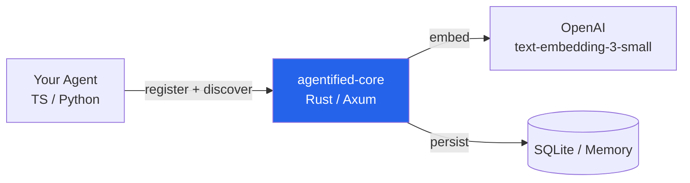
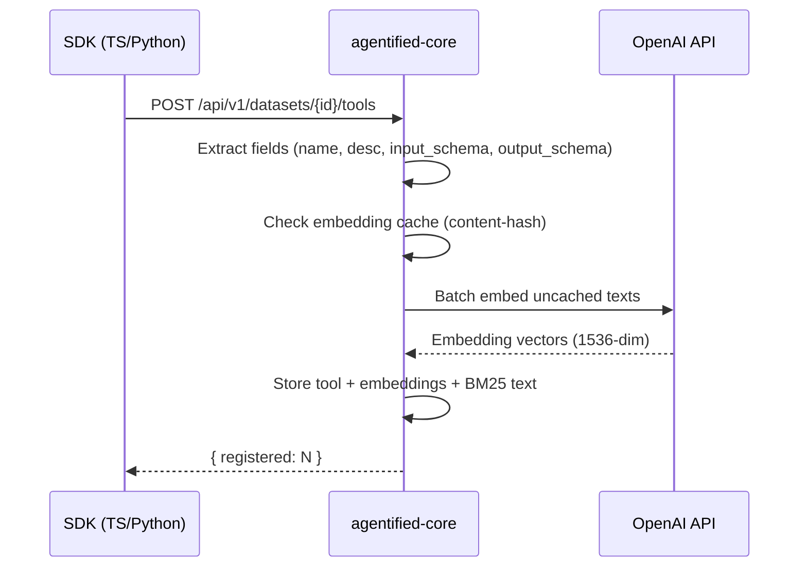
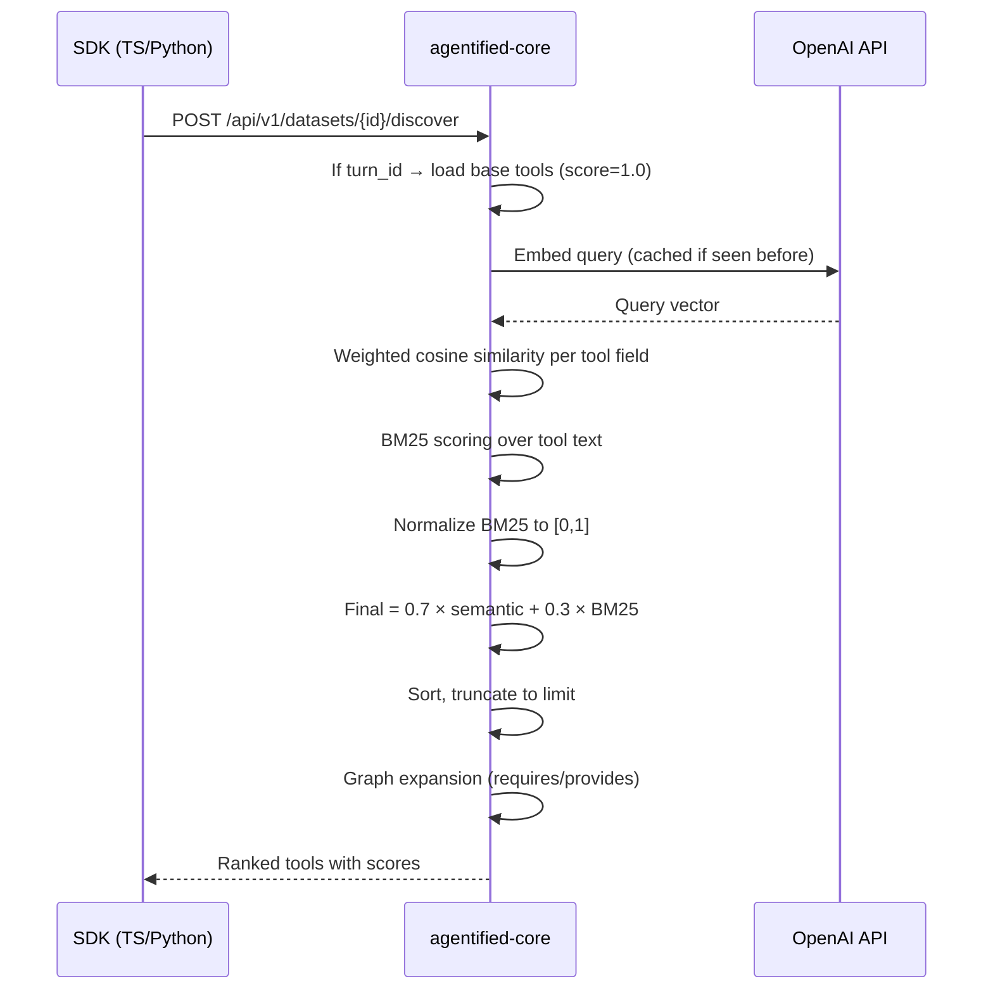

# Architecture

Agentified is a context intelligence layer — a Rust HTTP server that sits between your agent and your tools. It registers tool definitions, embeds them, and returns the most relevant subset for any query.

## System Overview



The core server exposes a REST API. SDKs (TypeScript, Python) wrap it. The server handles:

- **Tool registration** — store definitions + compute embeddings
- **Discovery** — hybrid-rank tools against a natural language query
- **Session continuity** — track which tools were used per turn
- **Graph expansion** — auto-inject dependency tools via requires/provides

## Registration Flow



**Key details:**

- Each tool has 4 embeddable fields: `name`, `description`, `input_schema`, `output_schema`
- Embeddings are cached by content hash — re-registering identical tools skips OpenAI calls
- BM25 text is a concatenation of all fields for keyword matching
- Storage write-through is async (fire-and-forget via `spawn_blocking`)

## Discovery Flow



## Ranking Algorithm

The hybrid ranking combines two signals:

### Semantic Similarity (70% weight)

Weighted cosine similarity across 4 tool fields:

| Field | Default Weight | Purpose |
|-------|---------------|---------|
| `name` | 0.1 | Tool name match |
| `description` | 0.5 | Primary semantic signal |
| `input_schema` | 0.3 | Parameter structure match |
| `output_schema` | 0.1 | Return type match |

Formula: `semantic = Σ(weight_i × cosine(query_emb, field_emb_i)) / Σ(weight_i)`

Weights are customizable per discover request via `embedding_weights`.

### BM25 Keyword Matching (30% weight)

Standard BM25 with `k1=1.2`, `b=0.75` over concatenated tool text. Raw scores are min-max normalized to [0, 1].

### Final Score

```
final_score = 0.7 × semantic_score + 0.3 × normalized_bm25
```

See [Hybrid Ranking deep dive](./concepts/ranking.md) for worked examples.

## Session Continuity

When a `turn_id` is provided to discover:

1. Load the referenced turn's `tools_loaded` list
2. Prepend those tools with `score=1.0` (always included)
3. Exclude them from the ranked results (no duplicates)
4. Append freshly ranked tools after the base tools

This ensures previously-used tools remain available across turns. See [Session Continuity](./concepts/session-continuity.md).

## Graph Expansion

After ranking, the server checks if any top-K tool has `metadata.requires` fields. If so, it scans all tools for ones with matching `metadata.provides` entries and injects them (up to 60% of `limit` extra tools, `graph_expanded: true`).

See [Graph Expansion](./concepts/graph-expansion.md).

## Storage

| Mode | Config | Behavior |
|------|--------|----------|
| **In-memory** (default) | — | Fast, no persistence. Data lost on restart. |
| **SQLite** | `AGENTIFIED_STORAGE=sqlite` | WAL mode, async write-through. All data loaded into memory on startup. |

SQLite stores:

| Table | Contents |
|-------|----------|
| `tools` | Tool definitions + field embeddings + BM25 text (keyed by dataset_id + name) |
| `turns` | Turn data (tools_loaded, message) |
| `embedding_cache` | Text → embedding vector mappings |
| `messages` | Conversation messages (dataset, namespace, session scoped) |

See [Storage](./concepts/storage.md) for configuration details.

## Why Rust

- **Axum** — async HTTP framework, tower middleware ecosystem
- **RwLock** — concurrent reads for discovery, exclusive writes for registration
- **Performance** — sub-millisecond ranking for 100s of tools
- **Memory** — embeddings stored as contiguous `Vec<f32>`, no GC overhead
- **SQLite via rusqlite** — zero-config persistence, WAL for concurrent reads

## API Endpoints

| Method | Path | Purpose |
|--------|------|---------|
| `GET` | `/health` | Health check |
| `POST` | `/api/v1/datasets/{id}/tools` | Register tools |
| `GET` | `/api/v1/datasets/{id}/tools` | List tools |
| `POST` | `/api/v1/datasets/{id}/discover` | Discover relevant tools |
| `POST` | `/api/v1/turns` | Capture a turn |
| `POST` | `/api/v1/messages` | Append messages |
| `GET` | `/api/v1/messages` | Get messages |
| `POST` | `/api/v1/context` | Get context (messages + strategy) |

Full API reference: [agentified-core README](../src/core/README.md).
