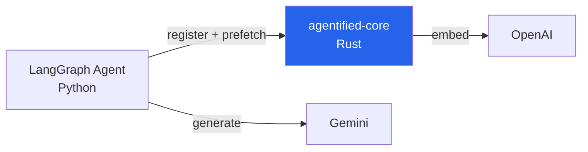

# Guide: LangGraph + Python SDK

Build a Python agent with LangGraph, Agentified context resolution, and Gemini. Based on the [py-langgraph example](../../examples/py-langgraph/).

## Architecture



- **LangGraph** — ReAct agent with tool calling
- **Agentified Python SDK** — register tools, prefetch relevant subset per turn
- **agentified-core** — tool registry + hybrid ranking
- **Gemini** — LLM for agent reasoning

## 1. Install

```bash
pip install agentified langgraph langchain-google-genai
```

## 2. Define tools

Define your LangChain tools as usual, then create matching Agentified `ServerTool` definitions for registration:

```python
from langchain_core.tools import tool as lc_tool
from agentified import ServerTool

@lc_tool
def get_employee(employee_id: str) -> dict:
    """Get employee details by ID."""
    return {"id": employee_id, "name": "Jane Doe", "department": "Engineering"}

@lc_tool
def list_employees() -> list:
    """List all employees."""
    return [{"id": "1", "name": "Jane Doe"}, {"id": "2", "name": "John Smith"}]

@lc_tool
def approve_time_off(request_id: str) -> dict:
    """Approve a time-off request."""
    return {"id": request_id, "status": "approved"}

# All LangChain tools
ALL_TOOLS = [get_employee, list_employees, approve_time_off]
TOOLS_BY_NAME = {t.name: t for t in ALL_TOOLS}

# Agentified registrations
SDK_TOOLS = [
    ServerTool(
        name=t.name,
        description=t.description,
        parameters=t.get_input_schema().model_json_schema(),
    )
    for t in ALL_TOOLS
]
```

## 3. Create the agent

```python
from agentified import Agentified, AgentifiedConfig
from langchain_google_genai import ChatGoogleGenerativeAI
from langgraph.prebuilt import create_react_agent

PREFETCH_LIMIT = 15

async def run_agent(messages: list[dict[str, str]]):
    async with Agentified(AgentifiedConfig(
        server_url="http://localhost:9119",
        tools=SDK_TOOLS,
    )) as client:
        await client.register()

        # Prefetch relevant tools
        ranked = await client.prefetch(messages=messages, limit=PREFETCH_LIMIT)

        # Build LangChain tools from ranked results
        turn_tools = [TOOLS_BY_NAME[r.name] for r in ranked if r.name in TOOLS_BY_NAME]

        # Create LangGraph ReAct agent with only the relevant tools
        llm = ChatGoogleGenerativeAI(model="gemini-3-flash-preview")
        graph = create_react_agent(llm, turn_tools, prompt="You are an HR assistant.")

        return await graph.ainvoke({"messages": messages})
```

## 4. Run

```bash
# Terminal 1: agentified-core
docker run -p 9119:9119 -e OPENAI_API_KEY=sk-... agentified/agentified-core

# Terminal 2: Python agent
GOOGLE_API_KEY=... python -c "
import asyncio
from agent import run_agent
result = asyncio.run(run_agent([{'role': 'user', 'content': 'List all employees'}]))
print(result)
"
```

## Multi-Turn Pattern

For multi-turn conversations, capture turns and pass `turn_id`:

```python
async with Agentified(AgentifiedConfig(
    server_url="http://localhost:9119",
    tools=SDK_TOOLS,
)) as client:
    await client.register()

    # Turn 1
    ranked = await client.prefetch(
        messages=[{"role": "user", "content": "Show me Jane's record"}],
        limit=PREFETCH_LIMIT,
    )
    turn_tools = [TOOLS_BY_NAME[r.name] for r in ranked if r.name in TOOLS_BY_NAME]
    # ... run agent ...

    result = await client.capture_turn(
        tools_loaded=[t.name for t in turn_tools],
        message="Show me Jane's record",
    )

    # Turn 2 — previous tools preserved with score=1.0
    ranked = await client.prefetch(
        messages=[{"role": "user", "content": "Approve her time-off request"}],
        limit=PREFETCH_LIMIT,
        turn_id=result.turn_id,
    )
```

## What Happens

1. SDK registers all tools → agentified-core embeds and caches them
2. `prefetch()` sends the user's message as query → core returns top-K tools ranked by hybrid score
3. Only those tools are passed to `create_react_agent()` → LLM sees 5 tools instead of 50+
4. Result: **86% fewer tokens**, same task accuracy

## See Also

- [py-langgraph example source](../../examples/py-langgraph/) — Complete working example
- [Session Continuity](../concepts/session-continuity.md) — Multi-turn patterns
- [Python SDK README](../../src/py-packages/sdk/README.md) — Full API reference
- [Hybrid Ranking](../concepts/ranking.md) — How scores are computed
