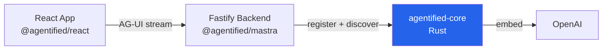

# Guide: Mastra + Agentified + React

Build a full-stack AI agent with Mastra, Agentified context resolution, React frontend tools, and the Inspector debug panel. Based on the [QuickHR example](../../examples/quickhr/).

## Architecture



- **React** — UI + frontend tool handlers + Inspector
- **Fastify** — AG-UI streaming endpoint, Mastra agent, Agentified adapter
- **agentified-core** — tool registry + hybrid ranking

## 1. Backend Setup

### Install

```bash
npm install agentified @agentified/mastra @mastra/core fastify @fastify/cors
```

### Define tools

```typescript
// tools.ts
import type { AgentifiedTool } from "@agentified/mastra";

export const tools: AgentifiedTool[] = [
  {
    name: "list_employees",
    description: "List all employees",
    parameters: { type: "object", properties: {} },
    handler: async () => {
      const res = await fetch("http://localhost:3003/api/employees");
      return res.json();
    },
  },
  {
    name: "navigate_to_page",
    description: "Navigate to a page in the app",
    parameters: { type: "object", properties: { page: { type: "string", enum: ["dashboard", "employees", "timeoff"] } }, required: ["page"] },
    type: "client",
  },
];
```

### Wire up the agent

```typescript
// index.ts
import Fastify from "fastify";
import cors from "@fastify/cors";
import { Agent } from "@mastra/core/agent";
import { Agentified } from "@agentified/mastra";
import { tools } from "./tools.js";

const ag = new Agentified();
await ag.connect("http://localhost:9119");

const dataset = await ag.dataset("hr-agent").register({ tools });

const agent = new Agent({
  name: "my-agent",
  instructions: "You are a helpful HR assistant.",
  model: "google/gemini-3-flash-preview",
  tools: { discoverTool: dataset.discoverTool },
  prepareStep: dataset.prepareStep,
});

const app = Fastify();
await app.register(cors, { origin: "*" });

app.post("/api/chat", async (req, reply) => {
  const { messages } = req.body as any;
  const session = dataset.session(req.headers["x-session-id"] as string);
  await session.updateConversation({ messages });
  const ctx = await session.context.messages({ strategy: "recent", maxTokens: 4000 }).build();
  const response = await agent.generate(ctx.messages);
  return reply.send(response);
});

app.listen({ port: 3003 });
```

The new API follows a `Agentified → dataset → instance → session` hierarchy with conversation persistence built in.

## 2. Frontend Setup

### Install

```bash
npm install @agentified/react @agentified/fe-client react
```

### App with Provider + Inspector

```tsx
import { AgentifiedProvider, Inspector, useAgentified, useAgentifiedTool } from "@agentified/react";

function FrontendTools() {
  useAgentifiedTool("navigate_to_page", async (args) => {
    window.location.href = `/${args.page}`;
    return { navigated: true };
  });
  return null;
}

function Chat() {
  const { messages, sendMessage, isLoading } = useAgentified();
  return (
    <div>
      {messages.map((m, i) => <p key={i}><b>{m.role}:</b> {m.content}</p>)}
      <button onClick={() => sendMessage("Show employees")} disabled={isLoading}>
        Send
      </button>
    </div>
  );
}

export function App() {
  return (
    <AgentifiedProvider agentUrl="http://localhost:3003/api/chat">
      <FrontendTools />
      <Chat />
      <Inspector defaultOpen />
    </AgentifiedProvider>
  );
}
```

## 3. Run

```bash
# Terminal 1: agentified-core
docker run -p 9119:9119 -e OPENAI_API_KEY=sk-... agentified/agentified-core

# Terminal 2: Backend
npx tsx index.ts

# Terminal 3: Frontend
npx vite
```

## What Happens

1. Backend registers all tools with agentified-core (embeddings computed + cached)
2. User sends "Show employees" via React chat
3. Backend calls `agentified.run()` → prefetch discovers `list_employees` + `navigate_to_page`
4. Mastra agent generates with hydrated tools, calls `list_employees` (backend) and `navigate_to_page` (frontend)
5. Frontend client intercepts `navigate_to_page`, runs handler, injects result back
6. Inspector shows prefetch results, tool calls, timing, token usage

## See Also

- [QuickHR example source](../../examples/quickhr/) — Complete working example
- [Frontend Tools](../concepts/frontend-tools.md) — How frontend tool interception works
- [@agentified/mastra README](../../src/ts-packages/mastra/README.md) — Full API reference
- [@agentified/react README](../../src/ts-packages/react/README.md) — Provider, hooks, Inspector API
