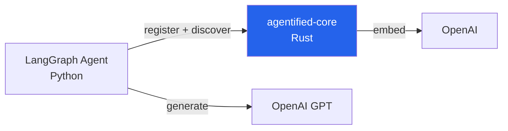

# Guide: LangGraph + Python SDK

Build a Python agent with LangGraph, Agentified context resolution, and OpenAI. Based on the [py-langchain-sdk-smoke example](../../examples/py-langchain-sdk-smoke/).

## Architecture



- **LangGraph** — ReAct agent with tool calling
- **Agentified Python SDK** — register tools, discover relevant subset per turn
- **agentified-core** — tool registry + hybrid ranking
- **OpenAI** — LLM for agent reasoning

## 1. Install

```bash
pip install agentified langgraph langchain-openai
```

## 2. Define tools

Define your tools with handlers, then register with Agentified:

```python
from agentified import Agentified, BackendTool, RegisterInput

TOOL_HANDLERS = {
    "get_employee": lambda args: {"id": args["employee_id"], "name": "Jane Doe"},
    "list_employees": lambda args: [{"id": "1", "name": "Jane"}],
    "approve_time_off": lambda args: {"id": args["request_id"], "status": "approved"},
}

ag = Agentified()
await ag.connect("http://localhost:9119")

instance = await ag.register(RegisterInput(tools=[
    BackendTool(name=name, description=f"{name} tool",
                parameters={"type": "object", "properties": {}},
                handler=handler)
    for name, handler in TOOL_HANDLERS.items()
]))
```

## 3. Create the agent

```python
from langchain_core.tools import StructuredTool
from langchain_openai import ChatOpenAI
from langgraph.prebuilt import create_react_agent

session = instance.session("my-session")

# Discover relevant tools for the query
discovered = await session.discover_tool.execute({"query": "Show me employee info"})

# Convert to LangChain tools
lc_tools = []
for rt in discovered:
    handler = TOOL_HANDLERS.get(rt.name)
    if handler:
        lc_tools.append(StructuredTool.from_function(
            func=lambda **kwargs, h=handler: h(kwargs),
            name=rt.name,
            description=rt.description,
        ))

# Create and run agent with only relevant tools
llm = ChatOpenAI(model="gpt-4o-mini")
agent = create_react_agent(llm, lc_tools, prompt="You are an HR assistant.")
result = await agent.ainvoke({"messages": [{"role": "user", "content": "Show me employee info"}]})
```

## 4. Run

```bash
# Terminal 1: agentified-core
docker run -p 9119:9119 -e OPENAI_API_KEY=sk-... agentified/agentified-core

# Terminal 2: Python agent
OPENAI_API_KEY=sk-... python main.py
```

## Multi-Turn Pattern

For multi-turn conversations, use session message persistence:

```python
session = instance.session("multi-turn-session")

# Turn 1: discover + run agent
discovered = await session.discover_tool.execute({"query": "Show me Jane's record"})
# ... run agent, get response ...

# Persist conversation
await session.update_conversation([
    {"role": "user", "content": "Show me Jane's record"},
    {"role": "assistant", "content": "Jane Doe, Engineering dept..."},
])

# Turn 2: context carries forward
discovered = await session.discover_tool.execute({"query": "Approve her time-off request"})
# Context from previous turns informs discovery

# Assemble full context
ctx = await session.context.messages(strategy="recent").assemble()
```

## What Happens

1. SDK registers all tools → agentified-core embeds and caches them
2. `discover_tool.execute()` sends the query → core returns top-K ranked tools
3. Only those tools are passed to `create_react_agent()` → LLM sees 5 tools instead of 50+
4. Session tracks conversation → context builds across turns
5. Result: **86% fewer tokens**, same task accuracy

## See Also

- [py-langchain-sdk-smoke example](../../examples/py-langchain-sdk-smoke/) — Minimal working example
- [py-langgraph example](../../examples/py-langgraph/) — Full HR agent example
- [Session Continuity](../../server/session-continuity.md) — Multi-turn patterns
- [Python SDK README](../../src/py-packages/sdk/README.md) — Full API reference
- [Hybrid Ranking](../../server/ranking.md) — How scores are computed
