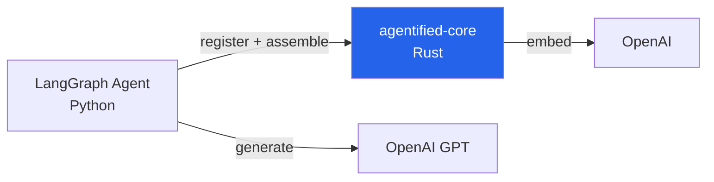

# Guide: LangGraph + Python SDK

Build a Python agent with LangGraph, Agentified context assembly, and OpenAI. Based on the [py-langchain-sdk-smoke example](../../examples/py-langchain-sdk-smoke/).

## Architecture



- **LangGraph** — ReAct agent with tool calling
- **agentified-langchain** — register tools, assemble context as LangChain StructuredTools
- **agentified-core** — tool registry + hybrid ranking
- **OpenAI** — LLM for agent reasoning

## 1. Install

```bash
pip install agentified-langchain langgraph langchain-openai
```

## 2. Define tools and register

```python
from agentified_langchain import LangchainAgentified, BackendTool, RegisterInput

TOOL_HANDLERS = {
    "get_employee": lambda args: {"id": args["employee_id"], "name": "Jane Doe"},
    "list_employees": lambda args: [{"id": "1", "name": "Jane"}],
    "approve_time_off": lambda args: {"id": args["request_id"], "status": "approved"},
}

ag = LangchainAgentified()
await ag.connect("http://localhost:9119")

instance = await ag.register(RegisterInput(tools=[
    BackendTool(name=name, description=f"{name} tool",
                parameters={"type": "object", "properties": {}},
                handler=handler)
    for name, handler in TOOL_HANDLERS.items()
]))
```

## 3. Assemble context and create the agent

```python
from langchain_openai import ChatOpenAI
from langgraph.prebuilt import create_react_agent

session = instance.session("my-session")

# Assemble context — tools are already LangChain StructuredTools
ctx = await session.context.messages(strategy="recent").assemble()

# Create and run agent with assembled tools
llm = ChatOpenAI(model="gpt-4o-mini")
agent = create_react_agent(llm, list(ctx.tools.values()))
result = await agent.ainvoke({"messages": [{"role": "user", "content": "Show me employee info"}]})
```

## 4. Run

```bash
# Terminal 1: agentified-core
docker run -p 9119:9119 -e OPENAI_API_KEY=sk-... agentified/agentified-core

# Terminal 2: Python agent
OPENAI_API_KEY=sk-... python main.py
```

## Multi-Turn Pattern

For multi-turn conversations, use session conversation persistence:

```python
session = instance.session("multi-turn-session")

# Turn 1: assemble context + run agent
ctx = await session.context.messages(strategy="recent").assemble()
agent = create_react_agent(llm, list(ctx.tools.values()))
result = await agent.ainvoke({"messages": [{"role": "user", "content": "Show me Jane's record"}]})

# Persist conversation
await session.update_conversation([
    {"role": "user", "content": "Show me Jane's record"},
    {"role": "assistant", "content": "Jane Doe, Engineering dept..."},
])

# Turn 2: context carries forward
ctx = await session.context.messages(strategy="recent").assemble()
# Previous turns inform tool ranking and message context
```

## What Happens

1. `agentified-langchain` registers tools → agentified-core embeds and caches them
2. `session.context.assemble()` discovers relevant tools → returns them as LangChain `StructuredTool` instances
3. Only those tools are passed to `create_react_agent()` → LLM sees 5 tools instead of 50+
4. Session tracks conversation → context builds across turns
5. Result: **86% fewer tokens**, same task accuracy

## See Also

- [py-langchain-sdk-smoke example](../../examples/py-langchain-sdk-smoke/) — Minimal working example
- [Session Continuity](../../server/session-continuity.md) — Multi-turn patterns
- [Python SDK README](../../src/py-packages/sdk/README.md) — Full API reference
- [agentified-langchain README](../../src/py-packages/langchain/README.md) — LangChain adapter API
- [Hybrid Ranking](../../server/ranking.md) — How scores are computed
