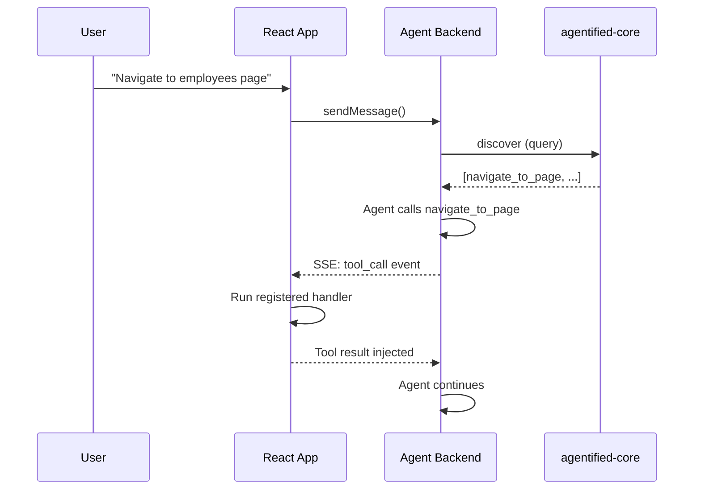

# Frontend Tools

Agentified supports tools that execute in the browser rather than on the server. This lets your agent trigger UI actions — navigate pages, open modals, read DOM state — while keeping the backend tool-agnostic.

## How It Works

### 1. Tag tools as frontend

Add `metadata.location: "frontend"` when registering:

```typescript
tool({
  name: "navigate_to_page",
  description: "Navigate to a page in the app",
  parameters: { type: "object", properties: { page: { type: "string", enum: ["dashboard", "employees", "timeoff"] } }, required: ["page"] },
  metadata: { location: "frontend" },
})
```

### 2. Register handlers client-side

**With `@agentified/fe-client`:**

```typescript
import { AgentifiedClient } from "@agentified/fe-client";

const client = new AgentifiedClient({ agentUrl: "/api/chat" });

client.registerToolHandler("navigate_to_page", async (args) => {
  window.location.href = `/${args.page}`;
  return { navigated: true };
});
```

**With `@agentified/react`:**

```tsx
import { useAgentifiedTool } from "@agentified/react";

function MyComponent() {
  useAgentifiedTool("navigate_to_page", async (args) => {
    router.push(`/${args.page}`);
    return { navigated: true };
  });
  return null;
}
```

`useAgentifiedTool` auto-unregisters on component unmount.

### 3. Execution flow



The fe-client intercepts tool calls marked as frontend, runs the handler locally, and injects the result back into the conversation stream.

### 4. Iteration loop

The client supports up to **5 iterations** of frontend tool calls per turn. This lets the agent chain multiple UI actions:

1. Agent calls `get_page_snapshot` → client returns DOM state
2. Agent calls `navigate_to_page` → client navigates
3. Agent calls `open_modal` → client opens a modal
4. Agent produces final text response

## Frontend Tool Filtering

When using the Mastra adapter, pass `frontendTools` to `run()` so the backend excludes them from server-side execution:

```typescript
const observable = await agentified.run({
  messages: [...],
  frontendTools: ["navigate_to_page", "open_modal"],
});
```

The SDKs provide helpers:

```typescript
// TypeScript
const names = agent.getFrontendToolNames();

// Python
names = agent.get_frontend_tool_names()
```

## Inspector

The React `<Inspector>` component visualizes frontend tool calls in real time — see which tools were intercepted, their arguments, results, and timing.

```tsx
import { Inspector } from "@agentified/react";

<Inspector defaultOpen />
```

## See Also

- [@agentified/fe-client README](../../src/ts-packages/fe-client/README.md) — Full API reference
- [@agentified/react README](../../src/ts-packages/react/README.md) — Provider, hooks, Inspector
- [Mastra guide](./integrations/mastra.md) — Full-stack example with frontend tools
