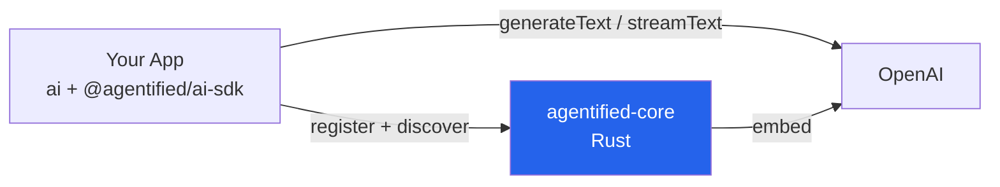

# Guide: Vercel AI SDK + Agentified

Use Agentified context resolution with Vercel AI SDK's `generateText` / `streamText`. Based on the [ai-sdk-smoke example](../../../examples/ts-ai-sdk-smoke/).

## Architecture



- **Your App** — AI SDK `generateText`/`streamText` with Agentified tools
- **agentified-core** — tool registry + hybrid ranking

## 1. Install

```bash
pnpm add agentified @agentified/ai-sdk ai @ai-sdk/openai zod
```

## 2. Define tools and generate

```typescript
import { Agentified } from "agentified";
import { aiSdk } from "@agentified/ai-sdk";
import { openai } from "@ai-sdk/openai";
import { generateText, stepCountIs } from "ai";

// Connect and register
const ag = new Agentified().adaptTo(aiSdk());
await ag.connect("http://localhost:9119");

const instance = await ag.register({
  tools: [
    {
      name: "get_weather",
      description: "Get current weather for a city",
      parameters: {
        type: "object",
        properties: { city: { type: "string" } },
        required: ["city"],
      },
      handler: async (args) => ({ temp: 22, city: args.city }),
    },
  ],
});

// Generate with tool calling
const session = instance.session("chat-1");
const result = await generateText({
  model: openai("gpt-4o-mini"),
  tools: session.tools,
  prepareStep: session.prepareStep,
  stopWhen: stepCountIs(10),
  prompt: "What's the weather in Rome?",
});

// Persist final step's messages
await session.flushMessages(result.steps);
```

### With Context Builder

```typescript
const ctx = await session.context
  .tools({ agentified_discover: session.discoverTool })
  .messages({ strategy: "recent", maxTokens: 4000 })
  .recall({ tools: true })
  .assemble();

const result = await generateText({
  model: openai("gpt-4o-mini"),
  tools: ctx.tools,
  prepareStep: ctx.prepareStep,
  stopWhen: stepCountIs(10),
  messages: ctx.messages.map((m) => ({ role: m.role as any, content: m.content })),
});

await ctx.flushMessages(result.steps);
```

## 3. Run

```bash
# Terminal 1: agentified-core
docker run -p 9119:9119 -e OPENAI_API_KEY=sk-... agentified/agentified-core

# Terminal 2: Your app
npx tsx index.ts
```

## What Happens

1. `register()` sends tool definitions to agentified-core, which computes embeddings
2. `session.tools` exposes all tools as AI SDK `tool()` objects — including `agentified_discover`
3. `prepareStep` fires before each LLM step, returning `{ activeTools }` to control which tools the model sees
4. The LLM calls `agentified_discover` first, then agentified-core ranks tools and returns the best matches
5. On subsequent steps, `prepareStep` activates the discovered tools so the LLM can call them
6. `flushMessages` persists the final step's messages (previous steps are flushed by `prepareStep`)

## Key Differences from Mastra Adapter

| Concern | Mastra (`@agentified/mastra`) | AI SDK (`@agentified/ai-sdk`) |
|---|---|---|
| Tool delivery | `prepareStep` returns `{ tools }` per step | `tools` property upfront; `prepareStep` returns `{ activeTools: string[] }` |
| Tool creation | `createTool()` from `@mastra/core` | `tool()` from `ai` |
| Final step | Handled by Mastra | Call `flushMessages(result.steps)` after generation |
| Streaming | `streamSSE()` export | Use `streamText()` from `ai` directly |

## See Also

- [ai-sdk-smoke example](../../../examples/ts-ai-sdk-smoke/) — Complete working smoke test
- [@agentified/ai-sdk README](../../../src/ts-packages/ai-sdk/README.md) — Full API reference
- [TypeScript SDK README](../../../src/ts-packages/sdk/README.md) — Core SDK docs
- [Mastra Integration](./mastra.md) — Alternative adapter for Mastra framework
